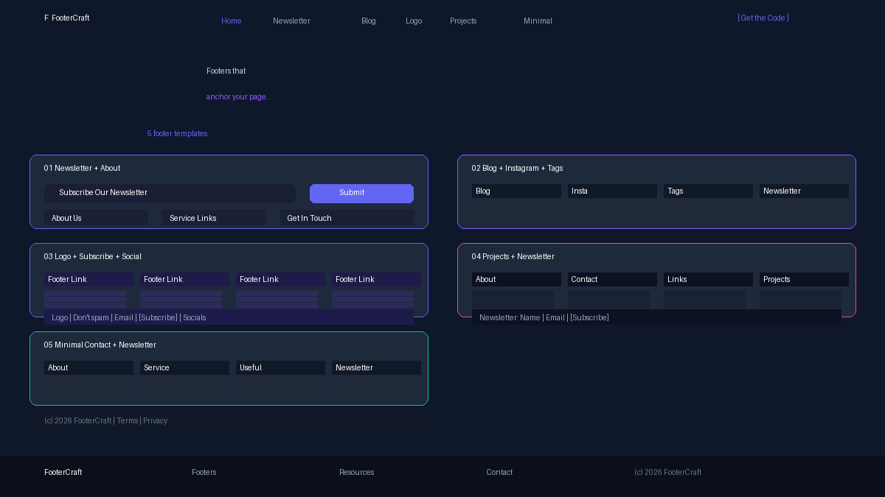

# FooterCraft — Bootstrap Footer Templates

**FooterCraft** is a premium, framework-free showcase of **5 footer templates** — newsletter bars, Instagram grids, tag clouds, project galleries, and multi-column layouts. Built with pure HTML5, CSS3 and a touch of vanilla JS — no libraries, no build tools, copy-and-paste ready.

**[View Live Demo →](https://uiuxlabz.github.io/bootstrap-footer-templates-html-template/)**

---

## ✨ What's Inside

| Footer Style | CSS class | What you get |
|---|---|---|
| **Newsletter + About** | `.f1` | Subscribe bar at top, About Us, 3-column links grid, contact info with social icons, menu bar, copyright |
| **Blog + Instagram** | `.f2` | 4-column: recent blog posts, Instagram 3×2 image grid, tag cloud, newsletter form, contact bar with phone/email/socials |
| **Logo + Subscribe** | `.f3` | About Us, 4-column link grid, centered bar with logo + "Don't spam" + email input + social icons |
| **Projects + Newsletter** | `.f4` | 4-column: About/socials, contact details, useful links, 3×2 project image gallery, full-width newsletter form |
| **Minimal Contact** | `.f5` | Clean 4-column: About/contact/socials, two link columns, newsletter form with name/email inputs |

Each footer is **self-contained** — grab the HTML snippet and its matching CSS rule and it works anywhere.

## 🚀 Getting Started

1. **Clone or download** this repository.
2. Open `index.html` in your browser — no server required.
3. Scroll through all five footer variants.

To use a style in your own project:

```html
<!-- 1. Copy the HTML -->
<div class="f1">
  <div class="f1-inner">
    <div class="f1-newsletter">
      <h2>Subscribe Our Newsletter</h2>
      <div class="f1-newsletter-form">
        <input type="email" placeholder="Email here">
        <button>Submit</button>
      </div>
    </div>
    <!-- more columns... -->
  </div>
</div>

<!-- 2. Copy the matching .f1 rules into your stylesheet -->
```

## 🗂 Project Structure

```
bootstrap-footer-templates-html-template/
├── index.html              # Single-page showcase (5 footer styles)
├── assets/
│   ├── css/
│   │   └── style.css       # Design tokens + all 5 footer styles
│   ├── js/
│   │   └── main.js         # Vanilla JS: nav toggle, reveal, back-to-top, smooth scroll
│   └── img/
│       ├── img-1.jpg … 6   # Original source images (used in Instagram/project grids)
│       └── img-preview.jpg  # Original concept preview
├── screenshot.png           # Preview image for galleries
└── README.md
```

## 📸 Screenshot



## 🎨 Design System

- **Palette:** Indigo `#6366f1`, violet `#8b5cf6`, pink `#ec4899`, teal `#14b8a6` on dark slate `#0f172a`
- **Type:** Bricolage Grotesque (display) + Inter (body)
- **Layout:** CSS Grid + Flexbox, fully responsive (992px / 768px breakpoints)
- **Motion:** 300–400ms eased transitions, IntersectionObserver reveal animations
- **No frameworks:** zero dependencies, zero build step

## 🛠 Customization

| Want to… | Do this |
|---|---|
| Change brand colors | Edit `--clr-indigo`, `--clr-violet`, `--clr-pink`, `--clr-teal`, `--clr-ink` in `:root` |
| Adjust column count | Tweak `grid-template-columns` in `.f2-grid`, `.f4-grid`, etc. |
| Modify newsletter style | Change background, border-radius, and input/button styles in `.f*-newsletter` |
| Tweak animation speeds | Change `transition` durations in the respective footer rules |

## 📄 License

This template is licensed under the **MIT License** — free for personal and commercial use. You may use, modify and redistribute it, provided you retain the copyright notice.

---

**Built with ❤️ by [UI/UX Labz](https://github.com/uiuxlabz)** · [View all templates](https://github.com/uiuxlabz) · **Ready to build something great? [Start a project →](mailto:hello@footercraft.dev)**
